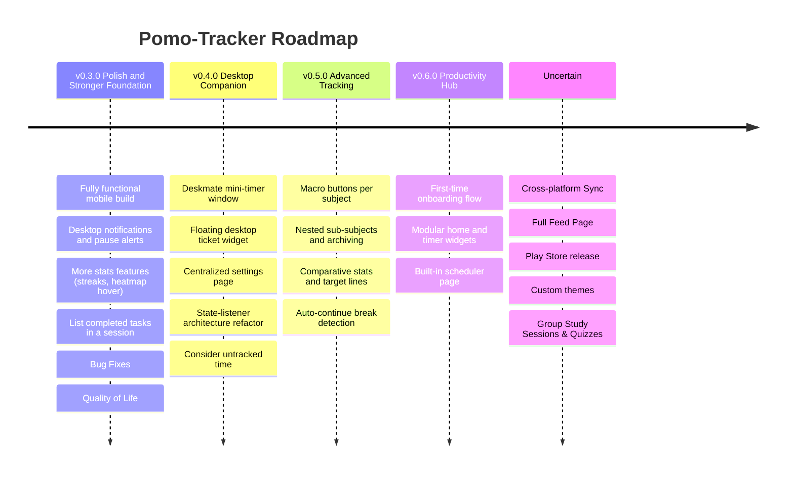

<div align="center">
  
  <h1>Pomo-Tracker</h1>
  <p><b>A modern, intuitive Pomodoro timer & productivity tracker with rich statistics and Discord presence.</b></p>

  <p>
    <a href="https://github.com/DJisaiah/pomo-tracker/releases"></a>
    <a href="LICENSE"></a>
    <a href="#installation"></a>
    <a href="https://flet.dev/"></a>
  </p>
  <sub><i>Windows (Microsoft Store & Executable) ⋅ Linux (AUR, AppImage, Executable) ⋅ macOS (Executable)</i></sub>
</div>

## Overview
- **Pomo-Tracker** is a simple, intuitive Pomodoro timer application built with Flet. 
    - It aims to help users boost productivity by adhering to the Pomodoro Technique with additional features like: 
        - **Custom timers** Ranging from 5mins to 8hrs
        - **Stopwatch modes** for sessions where you just want to work without a set time in mind
        - **Comprehensive productivity tracking**  for actually informative graphs and other tracking
        - **Discord Rich Presence** so your other friends can see your grind
        - **Feed Platform** to provide the ability to keep up with friends on studies/study habits and their stats.
            - See friend activity
            - Rankings to compete with your friends 
        - **Cross-Platform Stats Syncing** between other clients (desktop, mobile)

## Features

| Current Features: Timer Page | Current Features: Stats Page | Upcoming: Platforms & Sync | Upcoming: App Features |
| :--- | :--- | :--- | :--- |
| • Functional custom Pomodoro timer | • 365-day activity heatmap | • Cross-Platform Sync | • Rankings / Feed Page |
| • Implemented sound effects | • Subject time tracking graph (Daily, Weekly, Monthly, Yearly) | • Release on Android | • Settings Page |
| • Add & select tracking subjects | • Partial Feed Page | | • Custom User Themes |
| • Discord Rich Presence integration | | | |

> Besides new features coming in, old features will also be enhanced.    
   
### Screenshots

<div align="center">
    
</div>

<details>
  <summary><b>More Screenshots</b></summary>
  <br>
  
  <div align="center">
    
    
    
    <br><br>
    <b>Discord Rich Presence</b><br>
    
    
    <br>
    
    
  </div>
</details>

<details>
  <summary><b>Other Hero Images</b></summary>
  <br>
  <div align="center">
    
    <br><br>
    
  </div>
</details>

## Installation

> This project is under active development, and features are subject to change. If you find bugs/issues, kindly raise an issue with the `bug` or `feature` tag.

| Platform | Distribution Method | Quick Link / Command |
| :--- | :--- | :--- |
| **Windows** | Microsoft Store | [](https://get.microsoft.com/installer/download/9N5Z286TKJQ5?referrer=appbadge) |
| **Windows, Linux, macOS** | GitHub Releases | [Download Latest Binaries](https://github.com/DJisaiah/pomo-tracker/releases/latest) |
| **Arch Linux** | AUR (`pomo-tracker-bin`) | `paru -S pomo-tracker-bin` or `yay -S pomo-tracker-bin` |

<details>
  <summary><b>Arch Linux (AUR) Detailed Guide</b></summary>

You can install `pomo-tracker-bin` from the Arch User Repository using an AUR helper:

```bash
# Using paru
paru -S pomo-tracker-bin

# Using yay
yay -S pomo-tracker-bin
```

#### Manual Installation

If you prefer building manually without an AUR helper:

```bash
git clone https://aur.archlinux.org/pomo-tracker-bin.git
cd pomo-tracker-bin
makepkg -si
```

</details>

## Technologies Used
* **Flet**: GUI
* **Python**: The Core Language
* **SQLite**: Local Database for Stats and Settings 
* **pypresence**: Discord RPC
* **Subject Icons Images**: [Undraw Open Source Illustrations](https://undraw.co/)

## License
This project is licensed under the MIT License - see the `LICENSE` file for details.


