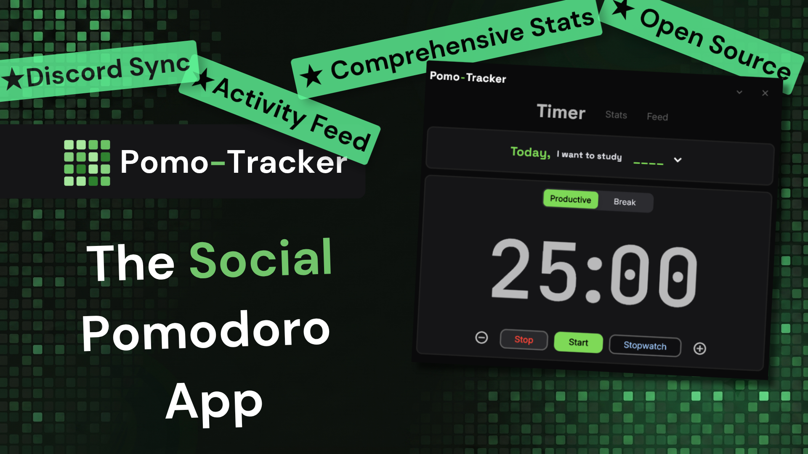
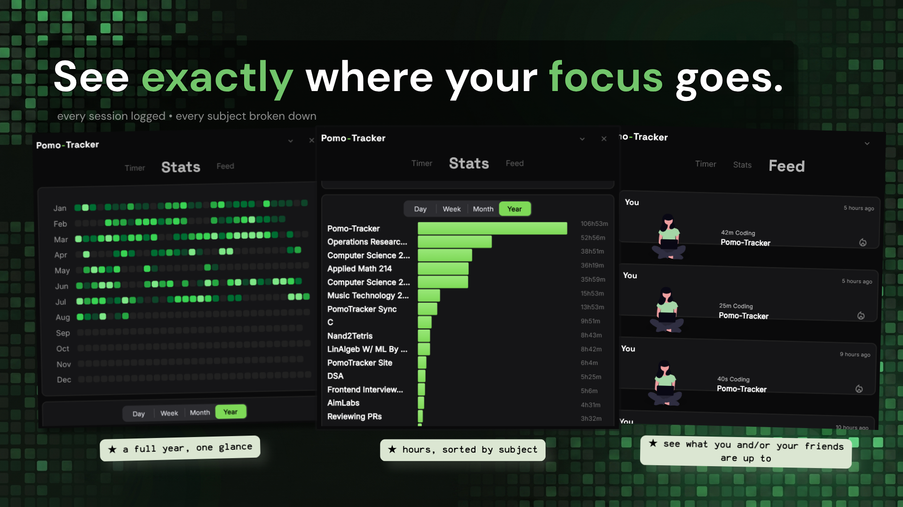
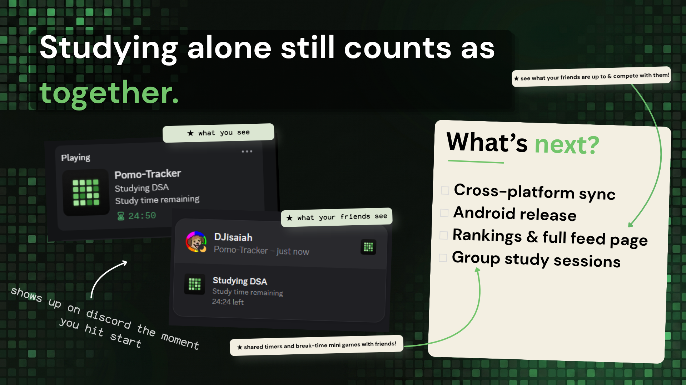

	
     
    <i>Windows (Microsoft Store & Executable) ⋅ Linux (AUR (soon) & Executable) ⋅ MacOS (Executable)</i>

</a>

## Overview
- **Pomo-Tracker** is a simple, intuitive Pomodoro timer application built with Flet. 
    - It aims to help users boost productivity by adhering to the Pomodoro Technique with additional features like: 
        - **Custom timers** Ranging from 5mins to 8hrs
        - **Stopwatch modes** for sessions where you just want to work without a set time in mind
        - **Comprehensive productivity tracking**  for actually informative graphs and other tracking
        - **Discord Rich Presence** so your other friends can see your grind
        - **Feed Platform** to provide the ability to keep up with friends on studies/study habits and their stats.
            - See friend activity
            - Rankings to compete with your friends 
        - **Cross-Platform Stats Syncing** between other clients (desktop, mobile)

## Features

| Current Features: Timer Page | Current Features: Stats Page | Upcoming: Platforms & Sync | Upcoming: App Features |
| :--- | :--- | :--- | :--- |
| • Functional custom Pomodoro timer | • 365-day activity heatmap | • Cross-Platform Sync | • Rankings / Feed Page |
| • Implemented sound effects | • Subject time tracking graph (Daily, Weekly, Monthly, Yearly) | • Release on Android | • Settings Page |
| • Add & select tracking subjects | • Partial Feed Page | | • Custom User Themes |
| • Discord Rich Presence integration | | | |

> Besides new features coming in, old features will also be enhanced.    
   
### Screenshots

    
<b>Timer Page and Stats Page Screenshots</b>

      
    

    
<b>Discord Rich Presence</b>

    
    
    
    

    
<b>Other Hero Images</b>

    
    

## Installation
- This project is under active development, and features are subject to change
- If you find bugs/issues kindly raise an issue with the "bug" tag or "feature" tag

    

        <b>Releases Page [Windows, Linux, MacOS]</b>
    

    <a href="https://github.com/DJisaiah/pomo-tracker/releases">Releases Page</a>

    

        <b>Microsoft Store[Windows]</b>
    

    

    

        <b>AUR (Arch User Repository) [Linux]</b>
    

    TODO

## Technologies Used
* **Flet**: GUI
* **Python**: The Core Language
* **SQLite**: Local Database for Stats and Settings 
* **pypresence**: Discord RPC
* **Subject Icons Images**: [Undraw Open Source Illustrations](https://undraw.co/)

## License
This project is licensed under the MIT License - see the `LICENSE` file for details.
